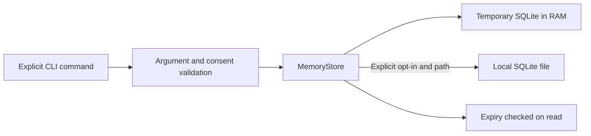

# Architecture

## Current implementation

`core/__main__.py` handles commands and returns structured JSON. `memory/store.py` validates inputs and uses parameterized SQL. The default store is process-local RAM; the demonstration always uses it. Persistent commands require both a database path and an explicit persistence flag.

The database contains note IDs, text and expiry timestamps. There is no user-account model, encryption, background scheduler or network server. The current code assumes a single trusted local user. Retention is enforced at query time; closing the program does not trigger background deletion from disk.

## Planned extension points

Voice and vision may eventually supply events to an orchestration layer. Tools should require explicit capabilities and consent before accessing sensors, sending information or modifying external state. This design is a roadmap, not an implemented security boundary. The existing empty directories preserve the original intended module layout.
